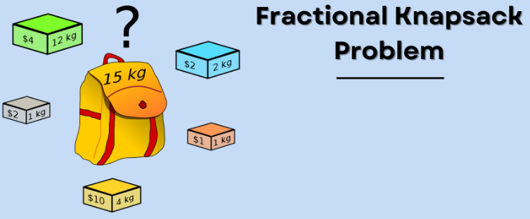

# Introduction to Greedy Algorithm

## What is the Greedy algorithm?

The greedy algorithm is defined as a method for solving optimization problems by making decisions that result in the most evident and immediate benefit irrespective of the final outcome.

For example: In the fractional knapsack problem, there is an ordered list of resources (value/weight, cost, profit, etc)

    

## When using the Greedy algorithm?

The greedy algorithm is a method used in optimization problems where the goal is to make the locally optimal choice at each stage with the hope of finding a global optimum. It is called “greedy” because it tries to find the best solution by making the best choice at each step, without considering future steps or the consequences of the current decision.

+ **Scheduling and Resource Allocation**: The greedy algorithm can be used to schedule jobs or efficiently allocate resources.
+ **Minimum Spanning Trees**: The greedy algorithm can be used to find the minimum spanning tree of a graph, which is the subgraph that connects all vertices with the minimum total edge weight.
+ **Coin Change Problem**: The greedy algorithm can be used to make change for a given amount with the minimum number of coins, by always choosing the coin with the highest value that is less than the remaining amount to be changed.
+ **Huffman Coding**: The greedy algorithm can be used to generate a prefix-free code for data compression, by constructing a binary tree in a way that the frequency of each character is taken into consideration.

## How does the Greedy Algorithm work?

